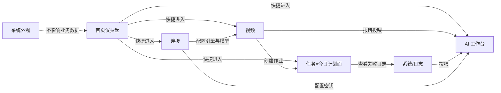

# GVFI 产品需求文档（PRD）

> 版本：V1.0（已确认基线）  
> 日期：2026-08-09  
> 产品名：GVFI · AI 视频工作站  
> 版权：Developed by Mr. Gong · Copyright © 2026 Mr. Gong. All Rights Reserved.  
> 状态：作为后续开发与验收依据；以本文件与当前仓库已实现契约为准。

---

## 1. 产品目标和使用场景

### 1.1 产品目标

GVFI 是面向 Windows 本地运行的 **AI 视频工作站**（Electron + Next.js + Python API），目标是：

1. 在本机完成视频 **RIFE 补帧 / 超分** 等渲染任务，不依赖云端渲染（云端仅为未来扩展 stub）。
2. 提供 **大模型视觉分析 / 对话工作台**，支持密钥与 Base URL 本地配置。
3. 以 **macOS Liquid Glass** 材质语言交付桌面级 UI（磨砂玻璃、悬浮交互、自适应布局），一页一责，专业可控。
4. 保持核心算法契约稳定：`VideoWorker` / `svfi_pipeline` **禁止因 UI 优化被破坏**。
5. 提供可诊断、可投喂 AI 的 **报错日志** 闭环。

### 1.2 使用场景

| 场景 | 角色 | 行为 |
|------|------|------|
| 本地补帧 | 创作者 / 后期 | 导入视频 → 选模型/FPS/超分 → 开始任务 → 在任务页查看输出 |
| 视觉分析 | 创作者 | 配置大模型 → AI 页上传/分析 → 阅读 Markdown 报告 |
| 故障排查 | 开发者 / 用户 | 查看报错日志 → 一键复制或投喂 AI → 获得修复建议 |
| 连接排障 | 运维 / 自用 | 「连接」页切换 API Profile（代理 `/api` 或直连 `:8765`）并检测健康 |
| 外观定制 | 自用 | 「系统」页调整主题、玻璃材质、背景；开发者查看插件与客户端日志 |

### 1.3 运行形态

- **主形态**：桌面端 `GVFI.exe`（Electron），本地浏览器内核加载 UI。
- **服务**：Web UI `127.0.0.1:3456`；渲染 API `127.0.0.1:8765`。
- **依赖目录**：仓库内 `ECCV2022-RIFE`、`AI_Tools` 相对位置不可随意拆散；工具由 `tool_resolver` 解析。

---

## 2. 整体页面框架和导航结构

### 2.1 框架

```
┌────────┬──────────────────────────────────────────────┐
│ 图标轨 │ TopBar（标题 / 面包屑 / 服务状态）             │
│ 侧栏   ├──────────────────────────────────────────────┤
│        │ Main（页面内容，一页一责）                      │
│ 首页   │                                              │
│ 任务   │                                              │
│ 视频   │                                              │
│ AI工作台│                                              │
│ 连接   │                                              │
│ 系统   │                                              │
└────────┴──────────────────────────────────────────────┘
```

- **侧栏**：图标轨主导航，无处理流程二级子导航。
- **主舞台**：大屏悬浮玻璃面板；小屏底部 Dock。
- **布局约束**：`workspace-layout` + AppShell（`min-w-0`、safe-area、`clamp` 间距），适配分辨率 / DPI / 窗口缩放。
- **动效档位**：`data-motion-quality = low | medium | high`（按硬件自动降级）。

### 2.2 主导航（已确认）

| 顺序 | 标签 | 路由 | 唯一职责 |
|------|------|------|----------|
| 1 | 首页 | `/app/dashboard` | KPI 总览与快捷入口 |
| 2 | 任务 | `/app/tasks` | 任务队列与输出 |
| 3 | 视频 | `/app/video` | 导入、预览、本地渲染 |
| 4 | AI 工作台 | `/app/ai` | 对话 / 视觉分析 / 报告 |
| 5 | 连接 | `/app/settings` | API Profile + 大模型连接 |
| 6 | 系统 | `/app/system` | 外观 / 开发者 / 日志 / 关于 |

### 2.3 兼容重定向（旧路由）

以下旧路径保留跳转，**不再作为独立产品页**：

- `/app/process*` → 视频 / 系统相关页  
- `/app/render` → 任务  
- `/app/models`、`/app/settings/api` 等 → 连接  
- `/app/settings/appearance` → 系统外观  

---

## 3. 首页的内容结构

首页 = **工作站仪表盘**（`GvfiDashboard`），结构如下：

1. **服务状态区**  
   - 引擎在线 / 离线 / 渲染中  
   - 模型数量、GPU 信息摘要  
2. **KPI 卡片**  
   - 队列数、进度、近期任务量等  
3. **趋势 / 分布可视化**  
   - 时段任务量折线（或等效）  
   - 状态分布（完成 / 失败 / 进行中）  
4. **快捷入口**  
   - 跳转「视频」「任务」「AI 工作台」「连接」  
5. **最近动态摘要**  
   - 最近任务日志一句摘要（若有）  

首页 **不承载**：长表单、补帧参数编辑、大模型密钥配置、完整日志滚动区。

---

## 4. 每个模块的用途

| 模块 | 用途 |
|------|------|
| **首页** | 一眼掌握引擎与任务健康度，快速进入工作流 |
| **任务** | 管理渲染/分析作业队列，查看状态、日志片段与输出 |
| **视频** | 素材导入、前后对比预览、启动/停止本地补帧；高级参数抽屉；侧栏挂载报错日志 |
| **AI 工作台** | 会话式对话、视觉分析作业、报告展示；接收报错日志投喂 |
| **连接** | 本地渲染 API Profile（Base URL / 超时 / 鉴权）+ 大模型服务商 / Key / Base URL 测试 |
| **系统** | 主题与 Liquid Glass 材质、开发者诊断、任务/报错日志、关于与版权 |

> 说明：外部曾提出「今日计划 / 自媒体 / 健身…」等个人生活模块，**未纳入 GVFI V1 产品范围**。V1「计划」语义收敛为 **当日/近期视频任务队列**（见第 6 节）。

---

## 5. 每个模块第一版最必要的数据和操作

### 5.1 首页

| 必要数据 | 必要操作 |
|----------|----------|
| `serviceReady`、队列数、进度、模型列表摘要、任务列表摘要 | 刷新健康状态；点击快捷入口跳转 |

### 5.2 任务

| 必要数据 | 必要操作 |
|----------|----------|
| Job 列表（id / status / progress / message / 输出路径） | 列表刷新；查看详情/日志；取消进行中任务（若 API 支持） |

### 5.3 视频

| 必要数据 | 必要操作 |
|----------|----------|
| 输入文件或本机路径、模型、FPS、分辨率、GPU、精度、超分开关与质量、预设、进度、前后预览 URL、任务/报错日志 | 选文件/填路径；应用预设；开始补帧；停止；打开高级参数；复制/投喂报错日志 |

### 5.4 AI 工作台

| 必要数据 | 必要操作 |
|----------|----------|
| 会话列表与消息、当前模型配置、分析报告（MD） | 新建/切换会话；发送/停止对话；粘贴或接收报错日志草案；发起视觉分析（若已配置） |

### 5.5 连接

| 必要数据 | 必要操作 |
|----------|----------|
| API Profiles（baseUrl、超时、并发、Key）、本地健康结果、LLM provider/model/apiKey/baseUrl | 增删改 Profile；设默认；检测本地 API；测试大模型连接 |

### 5.6 系统

| 必要数据 | 必要操作 |
|----------|----------|
| 主题、玻璃透明度/模糊/边框/阴影/辉光、背景预设或自定义图、任务日志、报错日志、插件清单 | 调整外观并即时生效；复制报错日志；投喂 AI；查看开发者诊断与关于页 |

---

## 6. 首页、今日计划（任务）和各模块之间关系

V1 中不设独立「今日计划」页面；**「任务」即当日工作计划面**。



| 关系 | 说明 |
|------|------|
| 首页 → 任务 | 展示队列摘要；详情在任务页 |
| 首页 → 视频 | 从总览进入处理流水线 |
| 视频 → 任务 | 开始补帧后作业进入队列 |
| 视频/系统 → AI | 报错日志一键投喂，AI 分析原因与修复建议 |
| 连接 → 视频/AI | 无可用引擎或密钥时，下游功能降级提示 |
| 系统 | 只改外观/诊断/日志展示，不改变任务算法契约 |

---

## 7. 本地数据文件、备份和恢复要求

### 7.1 前端持久化（浏览器 / Electron 本地存储）

| Key / 存储 | 内容 | 备份要求 |
|------------|------|----------|
| `gvfi-api-config-v1` | API Profiles | V1 应可导出 JSON（见 8.x）；至少不被意外清空 |
| `gvfi-appearance-v2` | 主题与玻璃参数 | 可随设置导出 |
| `gvfi-appearance-bg-image` | 自定义背景 data URL（独立存储） | 可选备份；体积大，导出时可提示 |
| AI 模型配置 store（含迁移自 `gvfi-llm-config-v1`） | 服务商 / model / Key / baseUrl | **含密钥**：备份文件需本地保管，禁止上传公开仓库 |
| `gvfi-ai-session-*`（会话 persist） | AI 对话历史 | 可清空；导出为可选 |
| `gvfi-ai-error-log-draft-v1` | 临时报错投喂草案（sessionStorage） | 无需长期备份 |

### 7.2 后端 / 桌面本地文件

| 路径 | 内容 |
|------|------|
| `ECCV2022-RIFE/user_data/uploads` | 上传缓存 |
| `ECCV2022-RIFE/user_data/output` | 渲染输出 |
| PyQt `ui_prefs` 设置（若存在） | 外观提示、背景路径 |
| `%APPDATA%\gvfi-desktop\gvfi-desktop.log` | Electron 启动与子进程日志 |
| `AI_Tools/`、模型目录、ffmpeg/rife 可执行文件 | **运行依赖**，默认不进 Git；用户环境需自行备份 |

### 7.3 备份与恢复（V1 要求）

**必须：**

1. 用户数据目录（`user_data`）与配置类 localStorage **可手工备份**（复制文件夹 / 导出说明写入系统关于或文档）。  
2. 恢复后：API Profile、外观、LLM 配置应能继续使用；已有输出文件路径仍可访问（若盘符未变）。  
3. 密钥仅存本机；备份介质由用户自管。  
4. Git 仓库忽略 `AI_Tools/`、打包产物、`user_data` 大文件，避免误提交密钥与二进制。

**V1 验收最低标准：** 文档说明「备份哪些路径 + 如何恢复」；系统页或文档可找到桌面日志路径。

**增强（可排期，非阻塞）：** 一键导出/导入配置 ZIP（Profiles + 外观 + LLM 不含明文 Key 的可选开关）。

---

## 8. 第一版必须完成的功能

### 8.1 核心业务

- [x] 本地 API：`/health`、`/jobs`、上传、取消、`/llm/test`、外观读取  
- [x] 视频页：导入 / 预览 / 开始 / 停止 / 高级参数（预设、模型、超分）  
- [x] 任务页：队列列表与状态  
- [x] AI 工作台：会话、网关统一调用（禁止业务模块直连大模型 URL）  
- [x] 连接：API Profile + 大模型配置与连通测试  
- [x] `tool_resolver` 解析 ffmpeg / RIFE / RealESRGAN（含 `AI_Tools` 候选根）  
- [x] 保留 `VideoWorker` / `svfi_pipeline` 契约  

### 8.2 体验与工程

- [x] 六大主导航一页一责；旧路由重定向  
- [x] Liquid Glass 按钮：Hover / Press 独立；**仅 scale，禁止控件 Y 位移**  
- [x] 布局自适应与 `motion-quality` 降级  
- [x] 报错日志：滚动查看、一键复制原始文本、投喂 AI  
- [x] 版权展示：`@/lib/brand` + `CopyrightFooter`  
- [x] 桌面启动：API 与 UI 并行就绪；日志落盘  
- [x] 本地 Git 仓库基线（忽略大体积依赖）  
- [x] 文档：`README`、`docs/api.md`、`docs/config.md`、`docs/motion.md`、`docs/design-system.md`、`CHANGELOG`  

### 8.3 V1 收尾仍须达到（验收前）

- [ ] 配置备份/恢复说明在系统关于或 README 可查（路径清单完整）  
- [ ] 主路径冒烟：启动 → 健康检查 → 视频页可选文件（或路径）→ 任务可见；连接页测试 LLM（有 Key 时）  
- [ ] 打包产物可从 `启动GVFI.cmd` / `dist-gvfi-fresh` 稳定拉起  

---

## 9. 第一版暂时不做功能

| 不做项 | 原因 |
|--------|------|
| 个人生活模块（今日计划独立页、自媒体、健身、饮食、游戏娱乐等） | 与 GVFI 视频工作站定位冲突；未立项 |
| 云端渲染正式对接 | 仅 stub，无生产队列 |
| 多用户账号 / 云同步 | 纯本地自用 |
| 插件商店与热插拔第三方包 | 仅内置插件注册表 |
| 移动端原生 App | 仅桌面 Electron + 本地 Web |
| 天气/风景类装饰元素 | 设计硬性禁止 |
| 修改 `VideoWorker` / `svfi_pipeline` 核心算法以迁就 UI | 稳定性红线 |
| 自动把密钥提交到 Git / 远程 | 安全红线 |
| 完整一键配置云备份（可选增强） | 不阻塞 V1 主路径 |

---

## 10. 可以实际检查的验收标准

### 10.1 启动与连通

| # | 检查项 | 通过标准 |
|---|--------|----------|
| A1 | 启动桌面版 | `启动GVFI.cmd` 或 `dist-gvfi-fresh\...\GVFI.exe` 可打开主窗口 |
| A2 | UI 可达 | `http://127.0.0.1:3456/app/dashboard` 返回 200 |
| A3 | API 健康 | `http://127.0.0.1:8765/health` 返回 JSON；`ffmpeg`/`rife` 字段可反映本机工具状态 |
| A4 | 六页导航 | 首页/任务/视频/AI/连接/系统均可进入且不白屏 |

### 10.2 信息架构

| # | 检查项 | 通过标准 |
|---|--------|----------|
| B1 | 一页一责 | 连接页无主题滑条；系统页无创建任务表单；视频页无 LLM Key 表单 |
| B2 | 旧路由 | 访问 `/app/process`、`/app/render` 会落到新 IA，不出现死链 |

### 10.3 视频与任务

| # | 检查项 | 通过标准 |
|---|--------|----------|
| C1 | 导入 | 可选择本地视频或填写路径 |
| C2 | 开始/停止 | 引擎就绪时可启动；进行中可停止（或明确禁用原因） |
| C3 | 任务可见 | 创建后任务页出现对应作业与状态变化 |
| C4 | 契约 | 补帧仍走现有 Worker，无因 UI 改动导致 API 字段缺失 |

### 10.4 AI 与日志

| # | 检查项 | 通过标准 |
|---|--------|----------|
| D1 | 连接测试 | 配置 Key 后「测试连接」有明确成功/失败文案 |
| D2 | 复制日志 | 报错日志「一键复制」后粘贴内容与面板一致（换行保留） |
| D3 | 投喂 AI | 点击后进入 AI 页，输入区自动带上完整原始日志包裹文本 |
| D4 | 网关约束 | 业务组件不直连第三方 LLM 域名；经 `ai-gateway` |

### 10.5 UI / 动效 / 布局

| # | 检查项 | 通过标准 |
|---|--------|----------|
| E1 | Hover | 鼠标悬停功能键：轴向轻微压缩 + 光影变化；**无整键上浮位移** |
| E2 | Press | 按下压缩更深，与 Hover 可区分；松开弹簧回弹 |
| E3 | 布局 | 窗口缩放、125%/150% DPI 下侧栏与主区无严重错位/裁切 |
| E4 | 降级 | `prefers-reduced-motion` 或低配档位下动画减弱且可操作 |
| E5 | 版权 | 关于/系统/启动相关界面保留 Mr. Gong 2026 版权两行 |

### 10.6 数据与工程

| # | 检查项 | 通过标准 |
|---|--------|----------|
| F1 | 配置持久 | 重启后 API Profile、外观、LLM 配置仍在 |
| F2 | 日志路径 | 可在文档或开发者页找到 `%APPDATA%\gvfi-desktop\gvfi-desktop.log` |
| F3 | Git | 本地仓库存在；大体积 `AI_Tools`/打包目录被 ignore |
| F4 | 文档 | 本 `PRD.md` 与 `web-ui/docs/*` 可对照开发 |

---

## 附录 A · 设计硬性约束（已确认）

1. Liquid Glass：磨砂、顶缘高光、弥散阴影；禁止天气/山川风景装饰元素。  
2. 按钮形变：**只用 scale**；Hover 与 Press 状态机分离。  
3. 优化不得造成已有核心功能缺失。  
4. 版权与品牌字符串必须来自 `@/lib/brand` / `CopyrightFooter`。  

## 附录 B · 相关文档索引

| 文档 | 路径 |
|------|------|
| 架构 | `web-ui/docs/architecture.md` |
| API | `web-ui/docs/api.md` |
| 配置 | `web-ui/docs/config.md` |
| 动效 | `web-ui/docs/motion.md` |
| 设计规范 | `web-ui/docs/design-system.md` |
| 更新日志 | `CHANGELOG.md` |
| 使用说明 | `README.md` |

---

**本 PRD 为 V1 已确认基线。** 后续新增模块（含个人管理类页面）须另开版本评审，不得静默挤占上述六大导航职责。
