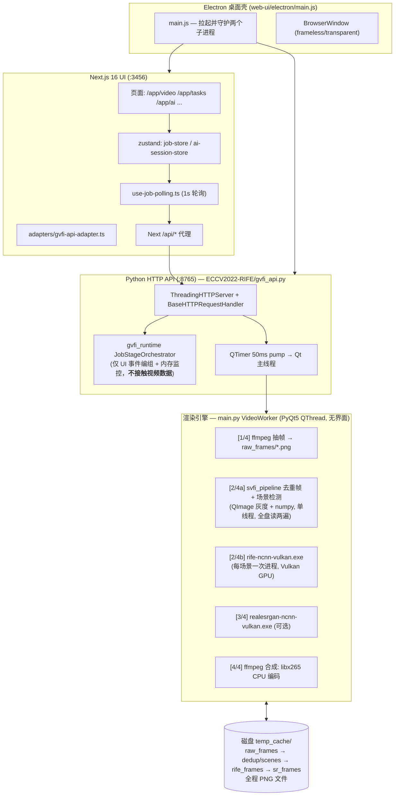

# PROJECT_AUDIT — GVFI 视频管线技术审查

> 审查日期：2026-08-10
> 审查人：高级视频算法 / 软件架构工程视角
> 审查目标：找出补帧效果、清晰度、GPU 利用率、运行速度不达预期的根因
> 范围：仅审查，不改代码。证据均标注 `文件:行号`。

---

## 0. 执行摘要（TL;DR）

当前生产管线**完全基于"外部进程 + 磁盘 PNG 序列"**：FFmpeg 把视频解码成全盘 PNG → Python 单线程做去重/场景检测（再读两遍全盘 PNG）→ 每个场景启动一次 `rife-ncnn-vulkan.exe`（Vulkan GPU 推理）→ 可选 `realesrgan-ncnn-vulkan.exe` → FFmpeg 读 PNG 用 **CPU libx265** 编码。

由此得出两个核心结论：

1. **GPU 利用率低的根因不是模型，而是架构**：推理只占全程的一小段，且被磁盘 IO、PNG 编解码、CPU 编码、逐场景进程重启切割得支离破碎。GPU 大部分时间在等数据。
2. **画质问题主要是"色彩链路未标记 + 前后端参数契约断裂 + 默认模型选择不当"**，而不是模型本身精度不够。不存在 1080p→720p→AI→1080p 的降采样（NCNN 路径全分辨率推理）。

---

## 1. 当前架构分析

### 1.1 总体架构图



### 1.2 视频数据流（每一步实际调用的代码）

| 阶段 | 实际代码 | 机制 |
|------|----------|------|
| ① 输入/任务创建 | `web-ui/src/lib/gvfi-api.ts:109-149` → POST `/jobs`；`gvfi_api.py:907-955` | multipart 上传或本地路径；**单任务**，并发返回 409（`gvfi_api.py:943-952`） |
| ② 参数翻译 | `gvfi_api.py:270-293` `_settings_to_worker_params` | **丢参数**：只保留 fps/scale/model/dedup/scdet；codec 写死 H.265、CRF 18、preset medium |
| ③ 探测 fps | `main.py:454-492` `_probe_fps` | ffprobe avg_frame_rate/r_frame_rate；失败默认 30.0 |
| ④ 音频提取 | `main.py:671-686` | ffmpeg → **AAC 192k 转码**（不先试 stream copy） |
| ⑤ 视频解码 | `main.py:690-697` | `ffmpeg -vsync 0 -qscale:v 1 → raw_frames/%08d.png`；**CPU 解码 + PNG 编码 + 全盘落盘**；无 `-hwaccel` |
| ⑥ 去重帧 | `svfi_pipeline.py:91-123`（`main.py:552-563` 调用） | QImage 逐帧解码为灰度 + numpy MAD；单线程全量扫描 |
| ⑦ 场景检测 | `svfi_pipeline.py:126-160`（`main.py:574-584`） | 再全量扫一遍：降采样 320px 灰度直方图相关距离 |
| ⑧ 场景切分 | `main.py:595-619` + `svfi_pipeline.py:218-231` | **每场景把 PNG 复制一份**（`copy_frame_range`），IO 翻倍 |
| ⑨ AI 推理 | `main.py:519-537` `_run_rife` → `rife-ncnn-vulkan.exe -i dir -o dir -n N -m model -f %08d.png` | NCNN/Vulkan GPU 推理；**未传 `-j`/`-g`**（默认 1:2:2 线程、auto GPU）；多场景 = 多次进程冷启动 + 模型重载 |
| ⑩ 超分（可选） | `main.py:712-733` | `realesrgan-ncnn-vulkan.exe -s {2,3,4} -n realesr-animevideov3`；**模型写死**，无视前端 srModel |
| ⑪ 编码输出 | `main.py:738-780` | ffmpeg 读 PNG → `libx265 -crf 18 -preset medium -pix_fmt yuv420p`；**纯 CPU 编码**；无 NVENC/QSV/AMF；**无色彩元数据标记** |
| ⑫ 进度上报 | `main.py:509-517` + `gvfi_runtime/job_orchestrator.py` | 只按 4 个阶段边界跳变；子进程 stdout 丢弃、stderr 仅结束后读取（`main.py:406-438`），无帧级进度 |

### 1.3 模块清单与角色

| 模块 | 角色 | 状态 |
|------|------|------|
| `web-ui/`（Next.js + Electron） | GUI 层 | **在用** |
| `gvfi_api.py` | 本地 HTTP API / 任务编排 | **在用** |
| `main.py` `VideoWorker` | 渲染管线核心 | **在用** |
| `svfi_pipeline.py` | 去重/场景检测/帧分配 | **在用** |
| `tool_resolver.py` | ffmpeg/rife/esrgan 路径解析（含 `AI_Tools/` 回退） | **在用** |
| `gvfi_runtime/` + `gvfi_native.dll` | UI 事件编组（IOKit WorkLoop 风格）+ 内存监控 | 在用，但**只影响 UI 事件，与视频速度/画质零关系** |
| `llm_video.py` | 大模型视频分析（抽帧→vision API→md 报告） | 在用（独立链路） |
| `inference_video.py` | 原版 PyTorch RIFE 推理脚本 | **死代码**（无人调用；且本机 torch=2.13.0**+cpu**，CUDA 不可用） |
| `model/`、`train_log/`（RIFE_HDv3、flownet.pkl 12MB） | PyTorch 版 RIFE v3.x HD 权重 | **死代码** |
| `AI_Tools/TensorRT-8.2.5.1/`、RealCUGAN torch 权重 | GPU 加速资产 | **闲置**（约数 GB 未接线的资产） |

---

## 2. AI 模型现状确认

| 问题 | 结论 | 证据 |
|------|------|------|
| **补帧模型是哪个？** | **RIFE，NCNN 版**，通过 `rife-ncnn-vulkan.exe`（2022-10-29 构建）子进程运行 | `main.py:519-537` |
| **RIFE 哪个版本？** | 目录内带 rife / rife-HD / rife-UHD / rife-anime / rife-v2~v4.6 共 11 套；**解析优先级第一是 `rife-v4.6`** | `svfi_pipeline.py:249-252`；但**前端默认模型是 `rife-anime`**（`presets.ts:38-46`、`process-workspace-context.tsx:159`），`rife-anime` 是 1.8 代老模型 |
| **ONNX / PyTorch / TensorRT / NCNN？** | **NCNN（Vulkan）**。PyTorch 路径是死代码；TensorRT 运行时在 `AI_Tools` 里闲置 | `main.py:519-537`；`torch 2.13.0+cpu, cuda: False`（本机实测） |
| **FP32 / FP16？** | NCNN 内部默认 **FP16** 存储/计算；前端有 fp16/fp32/int8 选择器，但**后端完全忽略 precision 参数** | `gvfi_api.py:281-293`（未读取 precision） |
| **CUDA 是否启用？** | **完全不涉及 CUDA**。Vulkan 是跨厂商 GPU API，NVIDIA 卡上能跑但效率通常低于 CUDA/TensorRT 路径 | 全链路无 torch/onnx 调用 |
| **模型加载方式** | 每场景启动一次 exe → 每次进程冷启动 + 模型（param/bin）从磁盘重新加载 | `main.py:595-619` |
| **推理是否真在 GPU？** | **是**（Vulkan `-g` auto 默认选独显）。但 GPU 只参与阶段 ⑨，被前后的 CPU/磁盘阶段饿死 | rife-ncnn-vulkan README `-g gpu-id default=auto` |
| **CPU 推理？** | 无（除非 Vulkan 初始化失败且未察觉——health 只检查 exe 存在性，不验证 Vulkan 可用性） | `gvfi_api.py:197-252` |
| **GPU↔CPU 频繁拷贝？** | 存在，且是**文件级**的：每帧 GPU 计算结果 → PNG 编码（CPU）→ 磁盘 → 下阶段再 PNG 解码（CPU）。ncnn 进程内还有 stb_image 解码开销 | 架构性证据：全程 PNG 目录 |
| **不必要格式转换？** | 有：YUV 视频 → RGB PNG →（GPU）→ RGB PNG → YUV420。色彩矩阵未指定（见 §4） | `main.py:690-697, 738-778` |
| **分辨率缩放降画质？** | NCNN 路径**无降采样**。但遗留 `inference_video.py:74-76` 有 `UHD → scale=0.5` 逻辑（1080p→540p 推理再插值），若未来启用该路径会踩坑 | `inference_video.py:74-76` |

---

## 3. 当前最大问题排名（按影响排序）

| # | 问题 | 影响域 | 影响说明 | 证据 |
|---|------|--------|----------|------|
| 1 | **磁盘 PNG 中间介质 + 严格串行四阶段** | 速度、GPU 利用率 | 每帧至少 2 次 PNG 编码 + 2 次解码 + 2 次磁盘读写。1080p 一分钟素材 ≈ 数万张 PNG / 数十 GB IO。解码、推理、编码互不重叠，GPU/CPU 轮流闲置 | `main.py:690-697, 519-537, 738-780` |
| 2 | **编码阶段纯 CPU（libx265 CRF18 medium）** | 速度、GPU 利用率 | 1080p+ 下 x265 medium 常常只有 10~25fps，常占总时长 30~50%；此期间 GPU 完全闲置。机器上的 NVENC 一点没用 | `main.py:738-748` |
| 3 | **逐场景一次 rife 进程冷启动** | 速度、GPU 利用率 | 每场景：复制 PNG（IO 翻倍）→ 启进程 → 重载模型 → 推理 → 写盘。场景越多 GPU 空转越多；电影级素材几十上百个场景时开销巨大 | `main.py:595-619`、`svfi_pipeline.py:218-231` |
| 4 | **rife-ncnn-vulkan 未传 `-j` 线程参数** | GPU 利用率 | 默认 `1:2:2`（load:proc:save），官方 README 明确"GPU 饥饿时加大线程"。PNG 解码只有 1 线程时 GPU 必然挨饿 | `main.py:522-529` vs README:84,95 |
| 5 | **前后端参数契约断裂** | 画质、功能正确性 | 前端发送的 `quality`（应映射 CRF）、`gpu`、`precision`、`srModel` **全部被后端丢弃**；UI 上这些控件是"假开关"。CRF 永远 18、模型永远 animevideov3、GPU 永远 auto | `gvfi_api.py:270-293` vs `gvfi-api.ts:121-131` |
| 6 | **色彩链路无矩阵指定/无元数据标记** | 画质（可感知色偏） | PNG(RGB,full range) → `yuv420p` 时 swscale 用默认矩阵（RGB→YUV 走 BT.601），且输出不写 colorspace/primaries/trc → 播放器对 HD 内容按 BT.709 猜 → **颜色发灰/偏色**，这是最典型的"画质低"体感 | `main.py:738-778`（无 `-colorspace/-color_*`） |
| 7 | **resolution→倍率映射是错的** | 画质、速度 | 前端"输出 1080p"被翻译成 ESRGAN **固定 2x**：1080p 源→变 4K（浪费 4 倍像素算力），480p 源→只有 960p（根本没到 1080p）。用户预期与实际输出系统性不符 | `gvfi_api.py:273-279` |
| 8 | **默认模型 rife-anime 用于所有内容** | 补帧效果 | rife-anime 是 1.8 代动漫特化模型，实拍内容光流估计明显弱于 v4.6 → 鬼影/破碎。而 v4.6 就在目录里，默认却没选它 | `presets.ts:38-46`、`svfi_pipeline.py:249-252` |
| 9 | **超分模型写死 realesr-animevideov3** | 画质 | 动漫向模型套实拍 → 塑料感/蜡像感；`realesrgan-x4plus`（实拍向）就在 models 目录里却没被使用；前端 srModel 三选一（realcugan/esrgan/swinir）全部无效 | `tool_resolver.py:32`、`main.py:717-727` |
| 10 | **去重 + 场景检测是两遍独立的全量 PNG 扫描** | 速度 | QImage 逐张解码 8-bit 灰度 + numpy 直方图，单线程，等于把整个视频用 CPU 又"解码"两遍 | `svfi_pipeline.py:91-160` |
| 11 | **10bit/HDR 源静默塌缩为 8bit SDR** | 画质 | PNG 8-bit 链路无 HDR 检测与 tone mapping；H.265 10bit 编码分支存在但没有 10bit 输入可吃 | `main.py:690-697, 745-748` |
| 12 | **音频一律转码 AAC 192k** | 音质（次要） | 未先尝试 `-c:a copy` 无损透传 | `main.py:671-686` |
| 13 | **无帧级进度解析** | 体验（非性能） | 子进程 stderr 结束后才读，进度条只在 4 个阶段边界跳动，用户感觉"卡住" | `main.py:406-438` |
| 14 | **环境依赖不一致** | 可维护性 | requirements 钉 `numpy<=1.23.5`，实际装 2.5.1；装了 torch(+cpu) 数百 MB 却是死代码 | `requirements.txt:2` vs 实测环境 |
| 15 | **遗留 inference_video.py 的质量陷阱** | 风险（未来） | 若有人启用 PyTorch 路径：`cv2.VideoWriter(mp4v)` 是有损低质编码 + CPU torch 无 CUDA | `inference_video.py:125,152` |

---

## 4. 画质下降原因（逐项核查）

### 4.1 是否存在"1080p ↓ 720p ↓ AI ↓ 1080p"式降采样？

**NCNN 生产路径：不存在。** 抽帧全分辨率（`main.py:690-697` 无 scale），RIFE 按原尺寸推理，超分只上不下。
**遗留 PyTorch 路径：存在隐患**——`inference_video.py:74-76`：`--UHD` 时 `scale=0.5`，即先在半分辨率推理（这是 RIFE 官方为 4K 显存妥协的设计），结果再放大回输出分辨率，细节必然损失。该路径当前是死代码，但属于"埋着的雷"。

### 4.2 RGB / BGR / YUV 转换核查

```
源视频(YUV, 可能 BT.709/601/HDR)
  → ffmpeg 解码 → PNG (RGB888, full range)        ← ① 未记录源色彩信息
  → rife-ncnn-vulkan (内部 RGB → ncnn tensor)
  → PNG (RGB888)
  → [可选 ESRGAN, 仍 RGB]
  → ffmpeg: RGB → yuv420p (limited range)          ← ② 默认 swscale 矩阵 BT.601
  → 容器无 colorspace/primaries/trc 标记           ← ③ 播放器自行猜测
```

- **②③ 是可感知画质 bug**：HD 内容被按 BT.601 转换、播放器按 BT.709 还原 → 红绿色偏、画面发灰或过饱和（取决于播放器）。修复仅需在合成命令加 `-vf scale=out_color_matrix=bt709 -colorspace bt709 -color_primaries bt709 -color_trc bt709`（SD 源对应 bt601）。
- 4:2:0 色度二次采样：交付格式正常损失，可接受。
- 10bit 路径已预留（`main.py:745-748` yuv420p10le），但 PNG 8bit 中间格式让它成为空摆设。

### 4.3 Tensor 转换核查（uint8→float→FP16→output）

NCNN 路径中该链条在 `rife-ncnn-vulkan.exe` 进程内部完成（stb_image 解码 uint8 → ncnn Mat → FP16 推理 → uint8 PNG），实现成熟，**无问题**。
遗留 PyTorch 路径 `inference_video.py:211-224, 269` 的 `uint8→float/255→pad→byte` 也是正确的（但 mp4v 编码毁一切，见 §3-15）。

### 4.4 最终 FFmpeg 编码参数核查

| 参数 | 当前值 | 评价 |
|------|--------|------|
| codec | libx265（API 路径写死；PyQt GUI 可选 10bit/AV1/ProRes） | 合理，但**纯 CPU** |
| CRF | 18（写死；前端 quality 滑块 0.8 被丢弃，不生效） | CRF18 本身高质量，**非画质瓶颈** |
| preset | medium（写死；GUI 里 CRF≤16 才用 slow） | 速度/质量折中合理 |
| pix_fmt | yuv420p | 兼容性最好；**但缺色彩矩阵标记（§4.2）** |
| 音频 | AAC 192k 强制转码 | 应优先 stream copy |
| 帧率 | `-framerate target_fps` 常量帧率 | **VFR 源会音画不同步**（抽帧按实际帧数、按时长近似目标帧数，`main.py:569` + `svfi_pipeline.py:268-279`） |

### 4.5 画质结论

按可感知程度排序的画质杀手：
1. **色彩矩阵错配/无标记**（所有输出视频都有，恒定存在）；
2. **rife-anime 默认模型处理实拍**（光流不准 → 运动区域破碎/鬼影）；
3. **animevideov3 超分处理实拍**（塑料感）；
4. **resolution 映射错误**导致意外 2x/4x 放大（把压缩伪影一起放大，且拖慢 4 倍）；
5. HDR/10bit 源塌缩；VFR 音画漂移（特定素材触发）。

---

## 5. GPU 利用率低的原因（对照提问逐项核查）

### 5.1 GPU 是否真正参与推理？

**是。** `rife-ncnn-vulkan.exe` 通过 Vulkan 使用 GPU（README:83 `-g default=auto`）。问题不在"用没用"，在"用了多少时间"——GPU 只在 [2/4] 阶段、且只在每个场景的 exe 进程存活期内工作。

### 5.2 是否存在"读一帧→处理一帧→等 GPU→写一帧"同步流程？

比那更糟——是**阶段级**串行（读完全部→才去重→才场景检测→才逐场景推理→才超分→才编码）。单场景视频在 RIFE 阶段内部由 ncnn 自己的 load/proc/save 线程流水线处理（这是唯一有并行的地方），但被 `-j` 默认值 `1:2:2` 卡住脖子（单线程 PNG 解码喂不饱 GPU）。

### 5.3 缺失项清单

| 能力 | 现状 | 位置 |
|------|------|------|
| 多线程读取 | ❌ 抽帧是单 ffmpeg 进程（解码多线程但 PNG 编码单线程）；ncnn 端 load 线程默认 1 | `main.py:690-697` |
| Frame Queue（跨阶段） | ❌ 阶段间靠磁盘目录做"队列"，无内存帧队列 | 架构性缺失 |
| Batch 推理 | ❌ ncnn rife 逐帧对处理；无批量 | 架构性缺失 |
| Pipeline 并行 | ❌ 解码/推理/超分/编码严格先后 | 架构性缺失 |
| GPU decode | ❌ 未用 `-hwaccel cuda/d3d11va` | `main.py:690-697` |
| GPU encode | ❌ libx265 CPU；未用 hevc_nvenc/qsv/amf | `main.py:738-748` |
| 多 GPU | ❌ `-g` 不可配（前端 GPU 选择器被丢弃） | `gvfi_api.py:270-293` |

### 5.4 GPU 利用率低的具体原因（归纳）

1. **时间占比**：RIFE 阶段通常只占全程 20~40%，其余时间（PNG 抽帧、两遍 CPU 扫描、x265 编码）GPU 利用率为 0。
2. **RIFE 阶段内部也喂不饱**：`-j` 默认 1:2:2，PNG 解码单线程成为瓶颈；GPU 在 load/save 间隙空转。
3. **场景越多越慢**：每个场景一次进程冷启动 + 模型重载 + PNG 复制，GPU 空转时间随场景数线性增长。
4. **CPU 也不饱和**：去重/场景检测是单线程 numpy；编码时 x265 能吃多核但此时 GPU 闲着——**没有任何两个重阶段重叠运行**。
5. **SVFI 为什么快**：SVFI 同样用 ncnn 工具链，但解码/推理/编码是重叠调度的（且默认可多实例、多线程参数调优、编码用硬件加速）。本项目只借鉴了其"去重+场景检测"的算法外壳，没有借鉴其调度内核。

---

## 6. 性能优化建议（分层；P0 不动结构，符合"不重构"约束）

### P0 — 参数级修复（1~2 天，风险极低，预计 2~4× 提速）

| ID | 动作 | 落点 | 预期收益 |
|----|------|------|----------|
| P0-1 | rife 调用加 `-j 2:2:2`（1080p 以上可 `4:2:4`）与 `-g {用户选择}` | `main.py:522-529` | RIFE 阶段提速 30~80%；GPU 选择器生效 |
| P0-2 | 编码器按硬件自动选择：`hevc_nvenc`(N卡) → `hevc_qsv` → `hevc_amf` → libx265 兜底；NVENC 用 `-rc constqp -qp 20` 或 `-cq 20` | `main.py:738-748` | 编码阶段提速 5~15×，释放 CPU |
| P0-3 | 修色彩：合成命令按源位深加 `out_color_matrix` + `-colorspace/-color_primaries/-color_trc` 标记 | `main.py:761-778` | 色偏消失，"画质低"主诉直接解决 |
| P0-4 | 修契约：`quality→CRF`（如 0.9→16, 0.8→20）、`srModel→超分模型/开关`、`precision/gpu` 接线或从 UI 下架假开关 | `gvfi_api.py:270-293` | UI 参数全部真实生效 |
| P0-5 | 修 resolution 映射：按"目标高度 / 源高度"计算倍率并就近取 2/3/4x，不足 1 则不超分 | `gvfi_api.py:273-279` | 输出分辨率符合预期，不再白算 4 倍像素 |
| P0-6 | 默认模型改为 `rife-v4.6`（实拍/动漫通吃且最新），rife-anime 仅动漫预设保留 | `presets.ts`、`svfi_pipeline.py:249-252` | 实拍补帧质量显著提升 |
| P0-7 | 实拍内容超分默认 `realesrgan-x4plus`，animevideov3 仅动漫预设 | `main.py:717-727`、`tool_resolver.py:32` | 去除塑料感 |
| P0-8 | 音频先 `-c:a copy`，失败再 AAC | `main.py:671-686` | 无损音轨 + 省一次转码 |
| P0-9 | 帧级进度：轮询输出目录 PNG 计数（零侵入）映射到阶段内进度 | `main.py` 阶段循环 | 进度条真实流动 |
| P0-10 | 场景分段加阈值：场景数 > N（如 8）才分段，否则单次跑 | `main.py:595-619` | 减少进程冷启动次数 |

### P1 — 管线化（3~5 天，只改 VideoWorker 内部，不动 API/GUI 契约）

| ID | 动作 | 预期收益 |
|----|------|----------|
| P1-1 | 解码 → 推理管道化：ffmpeg 以 `-f rawvideo`（或 image2pipe）写 stdout，边解码边喂 rife；去重/场景检测**合并进解码遍**（同一次解码产出灰度统计），消灭两遍独立全量扫描 | 消除阶段 ⑤⑥⑦ 的串行等待；磁盘占用 -50% |
| P1-2 | 推理 → 编码管道化：rife 输出目录改为边产边编（ffmpeg 读序列时 `-readrate` 控制，或先用命名管道/内存队列试点） | 编码与推理重叠，全程提速 30~60% |
| P1-3 | 抽帧输出从 PNG 改 **无损 WebP 或 BMP/PPM 直通**（ncnn 支持 webp；rawvideo 更优） | PNG 编码 CPU 开销大幅下降 |
| P1-4 | 单进程多场景：把场景列表拼成单个输入目录（带边界标记帧策略）跑一次 rife，替代逐场景冷启动 | 场景多的素材提速显著 |

### P2 — 引擎升级（另立项，1~2 周）

| ID | 动作 | 说明 |
|----|------|------|
| P2-1 | 评估 in-process 推理：ncnn Python binding / PyTorch+CUDA（换装 cu 版 torch）/ TensorRT（`AI_Tools` 已有 8.2.5.1 运行时） | 消灭全部中间文件与进程开销，是 SVFI 级性能的终态 |
| P2-2 | 接入 RealCUGAN ncnn（`AI_Tools/RealCUGAN_ncnn` 已存在）作为动漫超分选项 | 让前端 srModel 名符其实 |
| P2-3 | HDR/10bit 全链路（yuv420p10le 中间格式 + 已有 10bit 编码分支） | 补齐高端素材 |
| P2-4 | 基准测试套件：3~5 个固定样本（动漫 24fps / 实拍 30fps / 4K HDR），记录耗时、GPU 利用率、输出 SSIM，纳入 CI 或手动清单 | 让每次优化可量化、可回归 |

> 注意：`gvfi_runtime`（WorkLoop/内存监控）与视频性能无关，本轮优化**不需要**触碰。

---

## 7. 推荐下一阶段开发路线

```
Phase A（本周，P0 参数级）          → 目标：色彩正确 + 2~4× 提速 + UI 参数全真
  A1 P0-3 色彩链路修复（先做这个，画质主诉）
  A2 P0-4/P0-5 契约修复（quality/srModel/resolution/gpu）
  A3 P0-1/-j + -g 接线
  A4 P0-2 NVENC 编码
  A5 P0-6/P0-7 默认模型修正
  A6 用基准样本回归，记录前后指标

Phase B（下周，P1 管线化）          → 目标：再 1.5~2×，磁盘占用 -90%
  B1 P1-1 解码管道化 + 预处理合并
  B2 P1-2 推理/编码重叠
  B3 P1-3 中间格式替换
  B4 回归 + 指标对比

Phase C（另立项，P2 引擎）          → 目标：对标/超越 SVFI 的硬件利用率
  C1 in-process 推理技术选型 spike（ncnn-py vs torch-cu vs TRT）
  C2 落地 + 基准套件把关
```

每个 Phase 结束必须跑同一组基准样本并记录：总耗时 / 各阶段耗时 / GPU 平均利用率（`nvidia-smi --query-gpu=utilization.gpu --format=csv -l 1`）/ 输出文件 VMAF 或 SSIM 抽测。

---

## 8. Git 基线与开发流程建议

### 8.1 现状核查

| 检查项 | 状态 | 说明 |
|--------|------|------|
| Git 初始化 | ✅ | 仓库在 `D:\BaiduNetdiskDownload\GVFI` |
| 稳定版本 | ⚠️ 部分 | 有 tag `v1.0.0` 和 release CI（`.github/workflows/release.yml`），但**当前不在 main 上**：处于 `docs/baidu-mirror-and-download-guide` 分支，且有 **19 个未提交文件（+614/−83）**，内容是 AI 工作台功能，与该 docs 分支语义不符 |
| 测试环境 | ❌ 基本无 | 仅 `gvfi_runtime/tests/`（orchestrator/memory 单测）；**无管线冒烟脚本**（`scripts/smoke-health.cmd` 在 DEVELOPMENT_PLAN 里还是 TODO）；无视频基准回归 |

### 8.2 如何建立 v0.1 基准版本

"功能基线"已有（v1.0.0 tag）。缺的是**性能基线**——建议：

1. **先收拾工作区**（当前脏分支必须落地，否则基线不可复现）：
   ```powershell
   git checkout -b feat/ai-workspace-fix-protocol
   git add -A
   git commit -m "feat(ai-workspace): fix protocol, file copy, progress line and polling improvements"
   git checkout main
   ```
   （docs 分支只保留文档改动；功能改动放 feature 分支，之后走 PR。）
2. **从 main 切性能基线分支**：`git checkout -b perf/baseline-v0.1`
3. **冻结基准**：选定 3~5 个样本视频（不入库，只记录哈希与路径），用当前管线各跑一次，把耗时/阶段耗时/GPU 利用率/输出参数写入 `docs/benchmarks/v0.1-baseline.md` 并提交。
4. **打标签**：`git tag perf-baseline-v0.1`（annotated：`git tag -a`），作为所有后续优化的对照点。
5. **补冒烟脚本**：落地 `scripts/smoke-health.cmd`（DEVELOPMENT_PLAN Phase 2 已给出 PowerShell 片段），提交到同一分支。

### 8.3 下一次修改应该怎么提交

- **一个优化点 = 一个 commit**（或一个 PR），遵循仓库现有的 Conventional Commits 风格（`feat: / fix: / perf: / docs: / chore:`）：
  - `fix(api): map quality slider to CRF and honor srModel selection`
  - `fix(encoder): tag bt709 color metadata on H.265 output`
  - `perf(rife): pass -j/-g to rife-ncnn-vulkan`
  - `perf(encoder): add hevc_nvenc hardware encoding path`
- **不要把 UI 改动和管线改动混在一个 commit**（DEVELOPMENT_PLAN 已明令禁止"重构 Worker 混入 UI PR"）。
- 每个 `perf:` commit 附基准对比（前后耗时），写进 commit body 或 `docs/benchmarks/`。
- PR 走 `main ← perf/xxx`，合并前跑：① `npm run build`（若动了 web-ui）② `python -m pytest gvfi_runtime/tests` ③ smoke 脚本 ④ 基准样本回归。
- 大目录（`AI_Tools/`、`temp_cache/`、`dist*/`、模型 bin）继续留在 `.gitignore`，永不入库。

---

## 9. 附录：关键证据索引

| 主题 | 文件：行号 |
|------|-----------|
| 参数丢弃（quality/gpu/precision/srModel） | `ECCV2022-RIFE/gvfi_api.py:270-293` |
| resolution→倍率错误映射 | `ECCV2022-RIFE/gvfi_api.py:273-279` |
| 单任务 409 | `ECCV2022-RIFE/gvfi_api.py:943-952` |
| ffmpeg 抽帧 PNG | `ECCV2022-RIFE/main.py:690-697` |
| rife 调用（无 -j/-g） | `ECCV2022-RIFE/main.py:519-537` |
| 逐场景冷启动 + 帧复制 | `ECCV2022-RIFE/main.py:595-619` |
| ESRGAN 模型写死 | `ECCV2022-RIFE/main.py:717-727`、`tool_resolver.py:32` |
| libx265 CPU 编码 / 无色彩标记 | `ECCV2022-RIFE/main.py:738-778` |
| 音频强制转码 | `ECCV2022-RIFE/main.py:671-686` |
| 去重/场景检测两遍全扫 | `ECCV2022-RIFE/svfi_pipeline.py:91-160` |
| 模型优先级（v4.6 第一） | `ECCV2022-RIFE/svfi_pipeline.py:249-252` |
| 前端默认（rife-anime/120fps/SR 开） | `web-ui/src/lib/presets.ts:36-70`、`process-workspace-context.tsx:159-166` |
| 前端发送的完整参数 | `web-ui/src/lib/gvfi-api.ts:121-131` |
| Electron 拉起 API/Next | `web-ui/electron/main.js:129-278` |
| PyTorch 死路径 + scale 陷阱 | `ECCV2022-RIFE/inference_video.py:74-76, 125, 152` |
| gvfi_runtime 只管 UI 事件 | `ECCV2022-RIFE/gvfi_runtime/job_orchestrator.py:47-67` |
| 本机 torch=+cpu（CUDA 不可用） | 实测 `torch 2.13.0+cpu cuda: False` |
| rife-ncnn-vulkan 线程参数说明 | `ECCV2022-RIFE/rife-ncnn-vulkan-20221029-windows/README.md:84-95` |

---

Developed by Mr. Gong
Copyright © 2026 Mr. Gong. All Rights Reserved.
