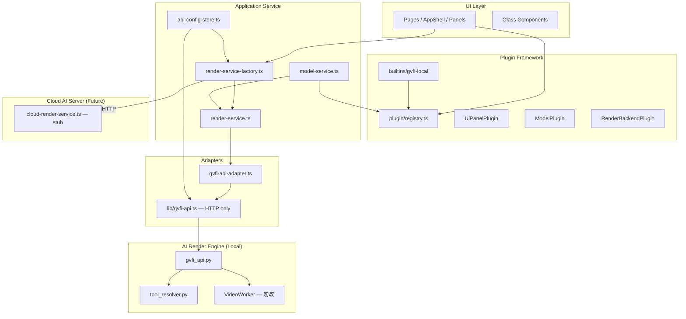
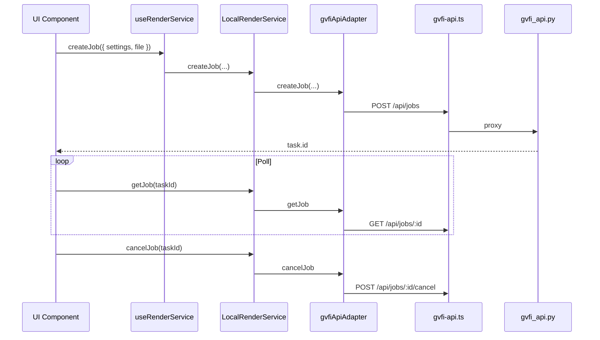

# GVFI Web UI 架构

> 分层目标：UI 与 AI 算法解耦、插件化扩展、API 配置独立、云端逻辑不进组件。
>
> **P0 规则：业务模块禁止直接调用大模型 API；一律经 `services/ai-gateway`。**

## 分层结构



> **2026-08 更新**：`api-client` 读取 `api-config-store` 活动 Profile；`tool_resolver` 扫描 `AI_Tools`。
>
> **2026-08 AI Workspace P0**：`/app/ai` 为三栏工作台；`ai-gateway` 统一 chat / 测试连接 / LLM 作业；模型配置在 `ai-model-config-store`；「连接」页仅保留本地渲染 Profile。

## 各层职责

| 层 | 职责 | 禁止 |
|----|------|------|
| **UI Layer** | 展示、交互、调用 `useRenderService()` / stores / AI Workspace | 直接 `fetch` 大模型端点、硬编码 API Key |
| **AI Gateway** | chat / cancel / testConnection / enqueueLlmJob | UI 状态、直接操作 DOM |
| **Plugin Framework** | 注册渲染后端、模型、AI 工具（`ai-tools.ts`） | 绕过 Gateway 调用上游 |
| **Application Service** | 任务生命周期、模型目录、API Profile、会话 store | 操作 DOM、WebGL |
| **Adapters** | JobSettings ↔ API payload、openai-compatible、gvfi-job | 业务 UI 状态 |
| **AI Render Engine** | 本地推理与编码（现有 Python） | — |
| **Cloud AI Server** | 未来远程渲染（当前 stub） | 逻辑写入 React 组件 |

## 任务数据流（创建 / 轮询 / 取消）



## 插件扩展点

### 1. 渲染后端 (`RenderBackendPlugin`)

```typescript
registerPlugin({
  id: "my-cloud",
  name: "My Cloud",
  version: "1.0.0",
  renderBackend: {
    id: "cloud",
    label: "My Cloud",
    kind: "cloud",
    createService: () => new MyCloudRenderService(),
  },
});
```

### 2. AI 模型 (`ModelPlugin`)

```typescript
registerPlugin({
  id: "extra-models",
  name: "Extra Models",
  version: "1.0.0",
  models: [{ id: "custom:rife-v4", name: "RIFE v4", path: "..." }],
});
```

`ModelService.listModels()` 合并 `/health` 与插件静态列表。

### 3. UI 面板 (`UiPanelPlugin`)

向 AppShell 注入可选路由面板（Phase 3+），不修改核心布局源码。

## API 配置与安全

- **Store**: `useApiConfigStore`（`localStorage`: `gvfi-api-config-v1`）
- **默认 Profile**: 本地 `/api` 代理，**无 apiKey/token 默认值**
- **敏感字段**: `apiKey` / `token` 仅存 store；日志使用 `redactProfile()`
- **桌面版**: 生产环境建议 Electron `safeStorage.encryptString()` 替代明文 localStorage（待 Phase 8 集成）
- **云端**: `CloudRenderService` 集中占位；UI 仅切换 `profile.kind === 'cloud'`

## 目录结构

```
src/
├── plugins/
│   ├── types.ts
│   ├── registry.ts
│   ├── index.ts
│   └── builtins/gvfi-local.ts
├── services/
│   ├── api-config-store.ts
│   ├── render-service.ts
│   ├── cloud-render-service.ts
│   ├── model-service.ts
│   ├── render-service-factory.ts
│   └── index.ts
├── adapters/
│   └── gvfi-api-adapter.ts
├── hooks/
│   └── use-render-service.ts
└── lib/
    └── gvfi-api.ts          # 低层 HTTP，仅 Adapter 调用
```

## UI 消费方式

```tsx
import { useRenderService } from "@/services";
import { getModelService } from "@/services";

function ProcessPage() {
  const renderService = useRenderService();

  async function handleStart() {
    const result = await renderService.createJob({ settings, file });
    // poll via renderService.getJob(result.task.id)
  }
}
```

新页面与插件应通过 **`useRenderService()`** 与 **`getModelService()`** 访问后端，保留 `KawaiiWorkspace` 逐步迁移至 Service 层，本阶段不强制重构 monolith。

## 约束

- 不修改 `VideoWorker`、`svfi_pipeline.py`、算法核心
- 不改变现有 `/api/*` 契约
- `/app` 保持可用；`gvfi-api.ts` 保留为 HTTP 层
